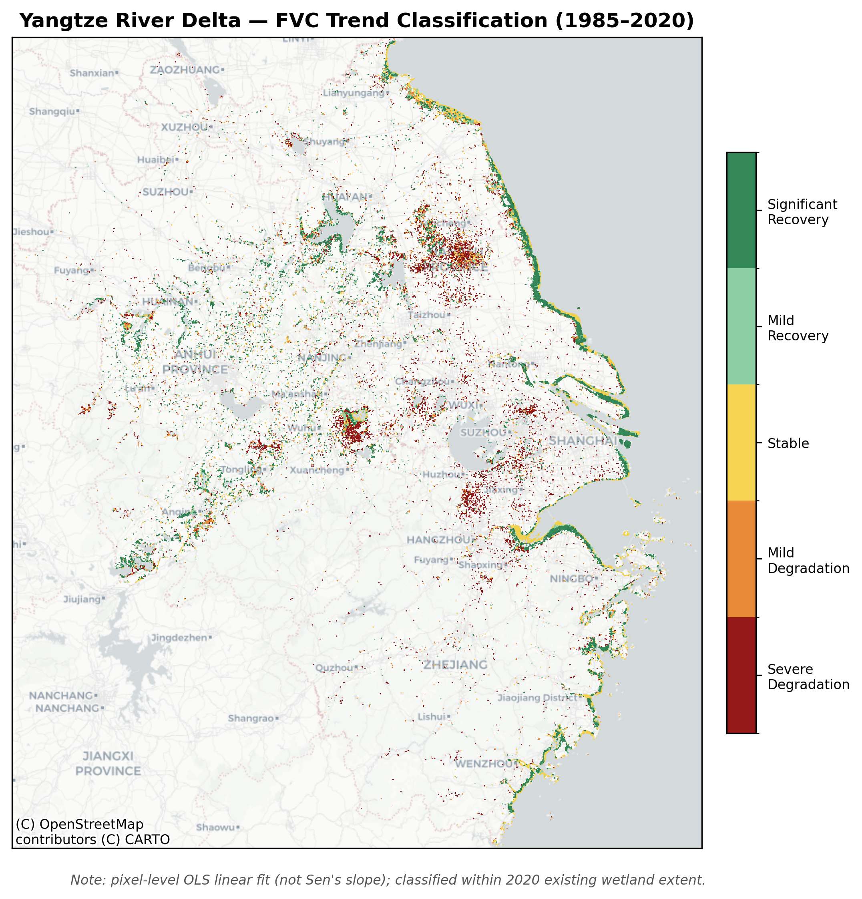

# wetland-fvc-pipeline

> **EN**: A reproducible geospatial data pipeline for analyzing multi-decadal wetland vegetation-cover change across three Chinese urban agglomerations (1985–2020)
> **中**：面向长时序遥感数据的可复现地理空间分析管线——三大城市群湿地植被覆盖变化案例（1985–2020）


*Yangtze River Delta wetland FVC trend classification, 1985–2020 (pixel-level OLS fit).*

---

## Background 项目背景

**EN**: This repository analyzes **Fractional Vegetation Cover (FVC)** change in wetlands across three major Chinese urban agglomerations from 1985–2020, based on Landsat time-series and Google Earth Engine. It originated from an undergraduate research project; the analytical design and implementation here are independently developed.

Study area: Yangtze River Delta (YRD), Greater Bay Area (GBA), Beijing-Tianjin-Hebei (BTH), 1985–2020.

**中**：本仓库基于 Landsat 时序影像与 Google Earth Engine，分析 1985–2020 年三大城市群湿地植被覆盖度（FVC）变化。项目起源于一项本科生科研项目，其中的分析思路设计与代码实现均为独立完成。

研究对象：长三角(YRD)、粤港澳大湾区(GBA)、京津冀(BTH) 三大城市群，1985–2020年。

## What This Does 这个仓库解决什么问题

- **EN**: Computes region-level dynamic FVC from Landsat time series using a dimidiate pixel model
  **中**：基于 Landsat 时序影像与二分像元模型，动态计算区域级 FVC（植被覆盖度）
- **EN**: Independent processing pipelines for 3 regions via a factory-function pattern, preventing cross-region data contamination
  **中**：多区域（3个城市群）独立处理管线，避免跨区域数据串线（工厂函数架构）
- **EN**: Wetland fate classification (persistent / gained / lost) + trend testing (Sen's slope + Mann-Kendall)
  **中**：湿地命运分组（持续/新增/丧失）+ 趋势检验（Sen's slope + Mann-Kendall）
- **EN**: Cross-method validation (dynamic vs. fixed endmembers; six-category area stats vs. transition matrix)
  **中**：跨方法交叉验证（动态端元 vs 固定端元、六类图 vs 转移矩阵）
- **EN**: Built on Google Earth Engine (cloud-scale raster processing) + Python geospatial stack (rasterio, pandas)
  **中**：基于 Google Earth Engine（云端栅格计算）+ Python 地理空间技术栈（rasterio、pandas）搭建

## Highlights: A Full Debugging & Validation Chain 亮点：一条完整的调试与验证链条

**EN**: The most valuable part of this project isn't the methods used — it's what actually broke in the data pipeline, and how it was diagnosed. Three representative examples:

**中**：这个项目最有价值的部分不是"用了什么方法"，而是数据管道真实出过的问题和排查过程，例如：

- **EN — Architecture fix**: A shared mutable `roi` variable across regions caused cross-region data contamination (the GBA/BTH scripts were actually computing YRD's geographic extent) → resolved by switching to a factory-function pattern for full isolation.
  **中 — 架构重构**：多区域共享可变 `roi` 变量导致跨区域数据串线（GBA/BTH 脚本实际算的是 YRD 的地理范围）→ 改用工厂函数模式彻底隔离

- **EN — Discrepancy diagnosis**: Six-category area stats diverged from the transition matrix by 1.7–2.2× → suspected cloud-gap noise (falsified) → suspected wetland-definition mismatch (partially falsified) → root cause: the two numbers were never meant to be directly comparable (different statistics) → cross-validation converged to <10% error once compared correctly.
  **中 — 口径不一致排查**：六类面积统计与转移矩阵结果偏差 1.7–2.2 倍 → 怀疑云缺失噪声（证伪）→ 怀疑湿地判断口径不一致（部分证伪）→ 最终定位为"两个统计量本来就不该直接比较" → 交叉验证误差收敛到 10% 以内

- **EN — Getting the year convention right**: Wetland "lost" pixels were originally measured at the interval's end year with a dynamic mask, which is empty by definition (a lost pixel is no longer wetland at that year) — the group came back empty. A later fix removed the mask but still measured the wrong year, silently describing the new land cover instead of the wetland being lost. The final fix measures "lost" wetland at the year *before* conversion — the only year that answers the actual question. The underlying finding held up after the fix, and if anything came out stronger — this correction did not manufacture the result it now supports.
  **中 — 年份口径修正**："丧失"湿地最初用带掩膜的转化后年份统计，掩膜下必然为空；后续版本去掉掩膜但年份仍不对，结果能跑但测的是错误的东西（新地类而非原湿地）。最终版改用转化前一年，这是唯一能回答"消失前植被状态如何"的年份。修复后核心结论不仅未被推翻，反而证据更强——这个修正没有制造它所支持的结论。

Full log 完整调试记录见 [`docs/methodology_notes.md`](docs/methodology_notes.md)。

## Repository Structure 仓库结构

```
├── gee_scripts/       # GEE JavaScript — data processing & export (independently re-implemented)
├── colab_analysis/    # Python/Colab — statistical analysis & visualization
├── outputs/           # De-identified aggregated CSV results (no raw pixel/raster data)
├── report/            # 是否放完整报告待定，见 report/README.md
└── docs/
    └── methodology_notes.md   # Full methodology & debugging log
```

## Data & Reproducibility 数据与复现说明

**EN**: This repo does **not** include raw data. Landsat and GLC_FCS30D are public datasets with their own usage terms — code references them, but data itself must be obtained from official sources / GEE. `outputs/` contains only de-identified, region-level aggregated CSVs, no raw pixel-level data.

⚠️ **Known gap**: the administrative-boundary source (`china` in `gee_scripts/regions_config.js`) is currently a private GEE asset under this project's own account, and will not be accessible if you clone this repo and try to run the scripts as-is. See the warning comment at the top of `regions_config.js` for how to reconstruct it from public sources. This is documented rather than hidden — the pipeline logic itself is reproducible, the boundary data source is the part that currently isn't self-contained.

**中**：本仓库**不包含原始数据**（Landsat、GLC_FCS30D 均为有使用条款的公开数据集），代码中会说明数据来源，需自行在 GEE / 官方渠道获取。`outputs/` 中的 CSV 是脱敏后的区域级聚合结果，不含原始像元级数据。

⚠️ **已知缺口**：行政边界数据源（`gee_scripts/regions_config.js`里的`china`）目前指向本人私有GEE资产，clone本仓库后直接运行会因权限问题失败，`regions_config.js`文件顶部有详细的重建说明。这个问题选择如实标注而不是隐藏——pipeline的逻辑本身是可复现的，边界数据源这一环目前还不是开箱即用的。

## Collaboration Note 协作声明

**EN**: The original analysis pipeline was developed collaboratively with AI-assisted (conversational) debugging as part of a team project. The code in this repository is an independent re-implementation, written after understanding every key design decision (why a factory-function pattern, why endmembers must be computed dynamically, why fate-group classification can't use a binary mask) rather than a direct copy of the original.

**中**：本项目分析流程最初在 AI 辅助（对话式调试）下与团队协作完成；本仓库中的代码是在理解每个关键设计决策（为什么用工厂函数、为什么端元要动态计算、为什么命运分组不能用二值掩膜）基础上重新独立实现的版本。

## License

MIT License (code). Underlying datasets follow their own original licenses and are out of scope for this repository.
