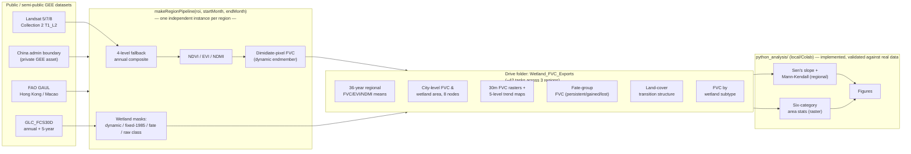

# Architecture

## Data flow

GEE performs server-side raster processing and exports intermediate products to Google Drive. Python consumes reviewed exports for statistical analysis, validation, and figure generation.

## Regional isolation

Earth Engine's Code Editor has no module system: scripts in `gee_scripts/` share one global scope when pasted together.

The early implementation reused a mutable top-level `roi`. Functions created while it pointed to one region could later evaluate against a different region after reassignment.

`makeRegionPipeline(roi, startMonth, endMonth)` closes over each region's own parameters, producing isolated YRD/GBA/BTH pipelines (`pipeYRD`, `pipeGBA`, `pipeBTH`).

## Two-stage execution

Earth Engine is server-side and is not launched through a local Python subprocess. GEE exports and Python analyses therefore form two connected stages.

Export tasks must be approved in the GEE Tasks tab. Files land in the Drive folder `Wetland_FVC_Exports` and are then used as Python inputs. Reviewed CSV evidence for the published workflow is already under [`../outputs/`](../outputs/).

## Export contract

All GEE exports land in a single Drive folder: `Wetland_FVC_Exports`. Column-level schema for every product is in [`data_schema.md`](data_schema.md).
