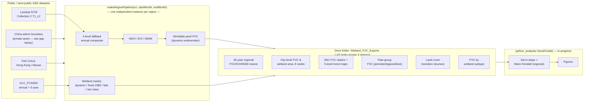

# Architecture 架构说明

## Data Flow 数据流向

## Why a Factory Function, Not Shared State

**EN**: Earth Engine's Code Editor has no module system — every script in `gee_scripts/` runs in the same global scope when pasted together. An earlier version of this pipeline used a single top-level `roi` variable shared by all three regions' processing functions. That created an implicit dependency: functions defined while `roi` pointed at one region could end up evaluating against a different region's extent after `roi` was reassigned, depending on execution order. `makeRegionPipeline(roi, startMonth, endMonth)` closes over its own `roi` parameter at call time, so `pipeYRD`, `pipeGBA`, and `pipeBTH` cannot leak into each other regardless of what happens to any global variable afterward. This is a design choice specifically to prevent cross-region data contamination — not a stylistic preference for functional patterns.

**中**：GEE Code Editor没有模块系统——`gee_scripts/`里的每个脚本粘贴到一起后运行在同一个全局作用域。早期版本用一个共享的顶层`roi`变量给三个区域的处理函数共用，这制造了一种隐式依赖：某个函数在`roi`指向某区域时被定义，之后`roi`被重新赋值后，根据代码执行顺序，这个函数有可能仍然按旧的地理范围计算。`makeRegionPipeline(roi, startMonth, endMonth)`在调用时把自己的`roi`参数锁定在闭包内部，所以`pipeYRD`/`pipeGBA`/`pipeBTH`不会互相污染，不管之后任何全局变量发生什么变化。这是专门为了防止跨区域数据串线做的设计选择，不是对函数式风格的偏好。

## Two-Stage, Not One Command

**EN**: This is not a single-command pipeline, and it isn't trying to be. Earth Engine computation happens server-side in Google's infrastructure and has no local execution mode — a Python `subprocess` cannot drive it the way it could drive a local GDAL/rasterio script. The GEE stage and the Python stage are connected by an intermediate, human-supervised step: reviewing and downloading CSVs from Google Drive. This is a deliberate architectural constraint of the platform, not a gap in this repository's engineering.

**中**：这不是一个单命令pipeline，也没打算做成那样。Earth Engine的计算发生在Google基础设施的服务端，没有本地执行模式——不能像驱动本地GDAL/rasterio脚本那样用Python `subprocess`直接调度它。GEE阶段和Python阶段之间，靠一个有人工介入的中间步骤衔接：从Google Drive review并下载CSV。这是这个平台本身带来的架构约束，不是这个仓库工程上的缺口。

## Export Contract

All GEE exports land in a single Drive folder: `Wetland_FVC_Exports`. Column-level schema for every product is in [`data_schema.md`](data_schema.md).
